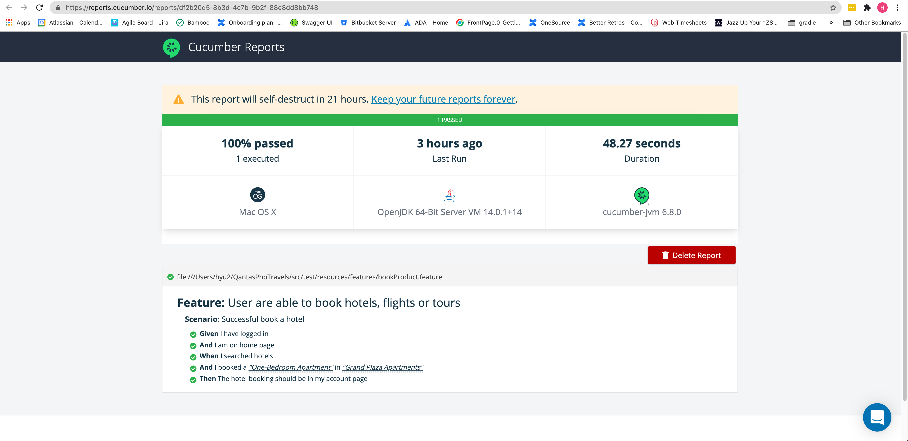

# QantasPhpTravels

This purpose of this project is to test the web application https://www.phptravels.net/home

so far the following test cases are covered:
 - Client be able to book hotel

The detail test cases, please reference to the feature files under src/test/resources/features

## How to setup the project
Just clone the project from github to your local folder (like QantasPhpTravels)

##How to run the tests in maven

Please run the command on Mac:
> mvn test -Dwebdriver.chrome.driver="./src/test/resources/mac/chromedriver"

Please run the command on Windows:
> mvn test -Dwebdriver.chrome.driver="./src/test/resources/windows/chromedriver.exe"

## Where to get the execute report
After you run the maven test, you can find the report url in the terminal, like https://reports.cucumber.io/reports/df2b20d5-8b3d-4c7b-9b2f-88e8dd8bb748

##Todo:
1. The WebDriverHooks only works when run scenario via the cucumber cli, which takes the screenshot for report and close the browser.
2. Add the step to clean up the data after the test, make each test independent without status leaking.
3. Reduce the sleep methods, try to find out when the page is real loaded
